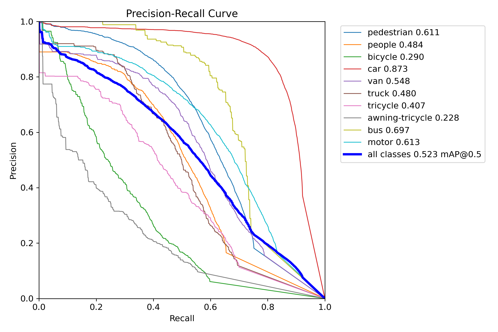
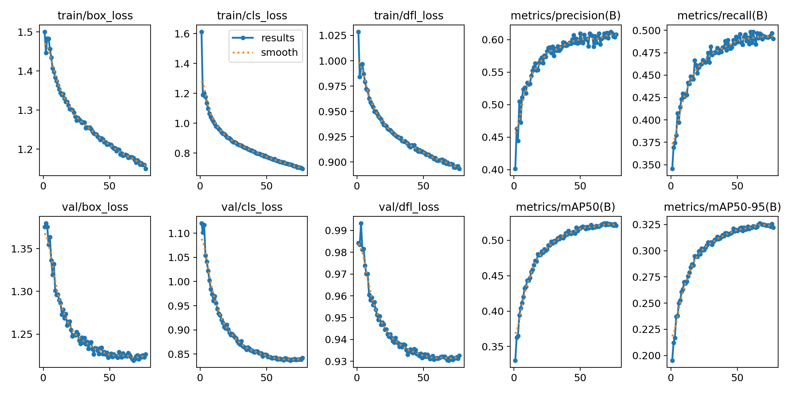

# VisDrone-detection
Решение задачи детекции на снимках с дрона с помощью YOLOv8
### Стек технологий
**Визуализация:** OpenCV, matplotlib — отрисовка изображений

**Обучение модели:** Ultralytics YOLOv8

### Результаты



### Запуск проекта
1. Клонирование репозитория
	```bash 
	git clone https://github.com/sofiachuleva/VisDrone-detection.git
 	```
 	```bash
    cd VisDrone-detection
	```
2. Создание виртуального окружения
    ```bash 
	python -m venv venv
	```
3. Активация окружения

    Для Mac/Linux:
    ```bash 
    source venv/bin/activate
    ```
    Для Windows в cmd:
    ```bash 
    venv\Scripts\activate
    ```
    Для Windows в Git Bash:
	```bash
 	source venv/Scripts/activate
 	```
4. Установка зависимостей
    ```bash 
    pip install -r requirements.txt
    ```
    ```
    pip install torch --index-url https://download.pytorch.org/whl/cu118
    ```
5. Запуск Jupyter Notebook
    ```bash 
    jupyter notebook
    ```
    Далее, откройте `VisDrone-detection.ipynb` и запустите все ячейки последовательно.
